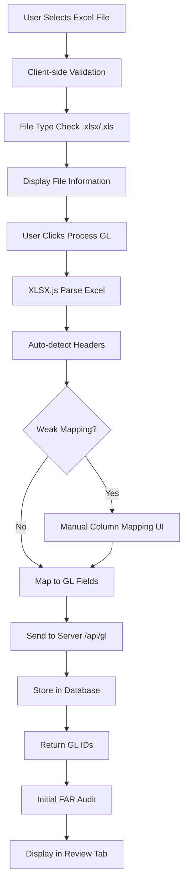
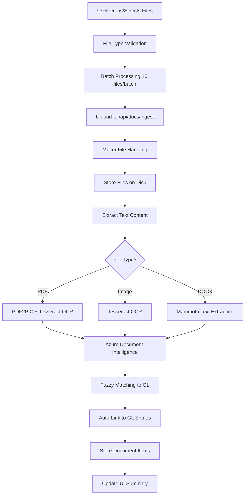
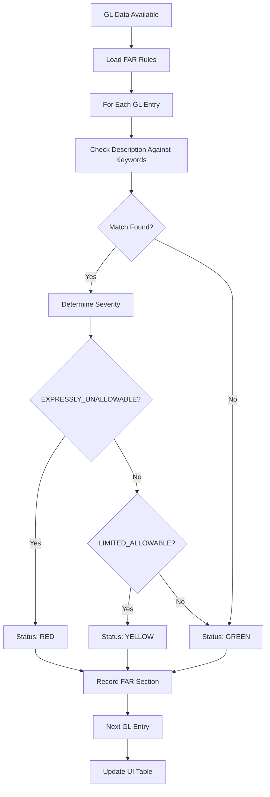
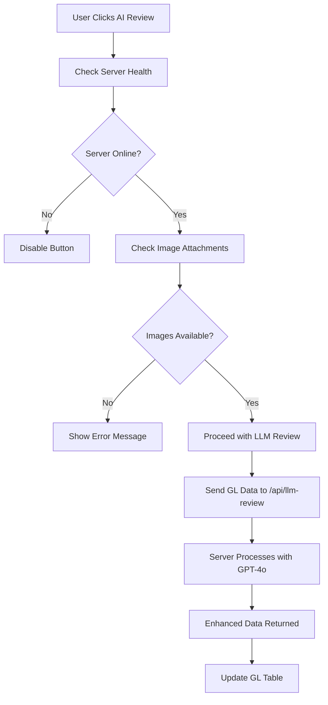
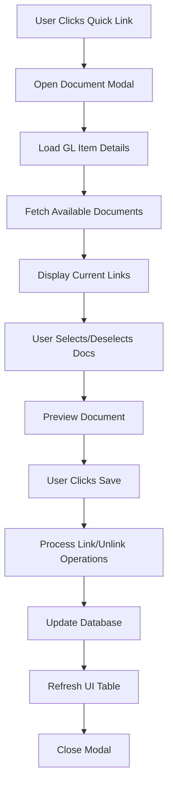
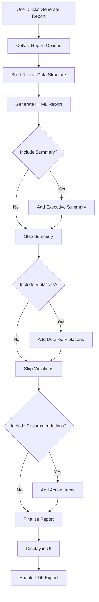
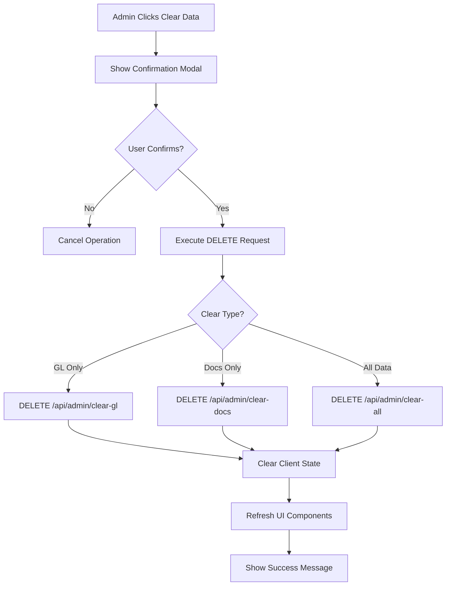

# FAR Compliance Audit System - Functional Flow Documentation

## System Overview

The FAR Compliance Audit System is a comprehensive web application designed to audit Federal Acquisition Regulation (FAR) compliance for government contractors. The system processes General Ledger (GL) data, analyzes supporting documents, and identifies potential compliance violations using rule-based auditing and AI-powered document analysis.

### Architecture Components

- **Frontend**: HTML/CSS/JavaScript with modular ES6 architecture
- **Backend**: Node.js/Express server with RESTful API
- **Database**: SQLite for data persistence
- **AI Integration**: Azure OpenAI (GPT-4o) and Azure Document Intelligence
- **Document Processing**: OCR with Tesseract.js and Azure Cognitive Services

---

## Core Functional Flows

### 1. GL Data Upload & Processing Flow

#### 1.1 File Upload Process


**Key Files:**
- `app.js` - `handleFileUpload()`, `processUploadedFile()`
- `modules/services/excelService.js` - Excel parsing and mapping
- `modules/services/auditService.js` - Initial audit processing

#### 1.2 Column Mapping Logic
The system uses intelligent field detection:

**Auto-Detection Patterns:**
- `accountNumber`: `/account|acct|gl.*account/i`
- `description`: `/description|desc|narrative|memo/i`
- `amount`: `/amount|total|value|cost|price/i`
- `date`: `/date|when|time/i`
- `vendor`: `/vendor|supplier|payee|company/i`

**Fallback Process:**
1. If auto-detection fails (< 2 essential fields mapped)
2. Read as Array of Arrays (AOA)
3. Detect header row using heuristics
4. Present manual mapping interface
5. User maps columns to GL fields

### 2. Document Ingestion & Processing Flow

#### 2.1 Document Upload Process


**Enhanced Processing with Azure Codex:**
- High-confidence documents use Azure Document Intelligence
- Structured data extraction (receipts/invoices)
- Better accuracy than basic OCR
- Confidence scoring and processing method tracking

#### 2.2 Fuzzy Matching Algorithm
Uses `fuzzball` library for GL entry matching:

```javascript
// Matching criteria (from backend processing)
- Vendor name similarity (>80% match)
- Amount matching (exact or within tolerance)
- Date proximity (within 30 days)
- Description keyword matching
```

### 3. FAR Compliance Audit Flow

#### 3.1 Rule-Based Audit Process


#### 3.2 FAR Rules Structure
**Rule Categories:**
- **EXPRESSLY_UNALLOWABLE** (RED flags)
  - Alcoholic beverages (31.205-51)
  - Lobbying/Political activities (31.205-22)
  - Entertainment costs (31.205-14)
  - Gifts and recreational activities (31.205-13)

- **LIMITED_ALLOWABLE** (YELLOW flags)
  - Travel costs (31.205-46)
  - Professional services (31.205-33)
  - Training/Education (31.205-44)

**Example Rule:**
```javascript
{
  section: "31.205-51",
  title: "Alcoholic Beverages",
  severity: "EXPRESSLY_UNALLOWABLE",
  keywords: ["alcohol", "wine", "beer", "spirits", "liquor", ...],
  description: "Costs of alcoholic beverages are expressly unallowable..."
}
```

### 4. AI-Powered LLM Review Flow

#### 4.1 Prerequisites & Validation


#### 4.2 LLM Integration Process
**Server-Side Processing:**
1. **Document Context Building**: Gather linked images/documents for each GL entry
2. **Azure OpenAI API Call**: Send structured prompt with document images
3. **Response Processing**: Parse AI analysis and recommendations
4. **Data Enhancement**: Add AI insights to GL entries (doc_summary, doc_flag_unallowable)

**Configuration Requirements:**
```javascript
// Environment variables in .env
AZURE_OPENAI_ENDPOINT=https://[resource].cognitiveservices.azure.com/...
AZURE_OPENAI_API_KEY=[api-key]
AZURE_OPENAI_DEPLOYMENT=gpt-4o
AZURE_OPENAI_API_VERSION=2025-01-01-preview
```

### 5. Document Linking Modal Flow

#### 5.1 Document Association Process


#### 5.2 Document Preview System
**Supported Preview Types:**
- **Images**: Direct display with `` tag
- **PDFs**: Embedded iframe viewer
- **Other Documents**: Download link with file info

**Caching Strategy:**
- Client-side preview cache for performance
- Lazy loading of document content
- Error handling for failed previews

### 6. Reporting & Export Flow

#### 6.1 Report Generation Process


#### 6.2 Report Structure
**Report Sections:**
1. **Executive Summary**
   - Total items processed
   - Violation counts by severity
   - Compliance rate percentage

2. **Detailed Violations**
   - Account number and description
   - Amount and vendor information
   - Specific FAR section violated

3. **Recommendations**
   - Immediate actions required
   - Long-term improvements
   - Process enhancement suggestions

### 7. System Administration Flow

#### 7.1 Data Management Operations


#### 7.2 System Health Monitoring
**Health Check Endpoints:**
- `/api/system/health` - Basic server status
- `/api/logs/analytics` - Log analysis and metrics
- `/api/logs` - Recent log entries with filtering

**Admin Controls:**
- Data clearing with confirmation dialogs
- Log retention management
- System status monitoring
- Error pattern analysis

---

## Data Models & API Endpoints

### Core Data Models

#### GL Entry Model
```javascript
{
  id: number,
  account_number: string,
  description: string,
  amount: number,
  date: string,
  category: string,
  vendor: string,
  contract_number: string,
  doc_summary: string,        // AI-generated summary
  doc_flag_unallowable: boolean // AI compliance flag
}
```

#### Document Model
```javascript
{
  id: string,
  filename: string,
  mimetype: string,
  size: number,
  upload_date: string,
  text_content: string,
  processing_method: string,   // 'basic_ocr' | 'codex_enhanced'
  confidence_score: number
}
```

### Key API Endpoints

#### Data Management
- `POST /api/gl` - Upload GL entries
- `GET /api/gl` - Retrieve GL entries with pagination
- `DELETE /api/admin/clear-gl` - Clear GL data

#### Document Processing
- `POST /api/docs/ingest` - Upload and process documents
- `GET /api/docs/items` - List documents and links
- `POST /api/docs/link` - Link document to GL entry
- `DELETE /api/docs/link` - Unlink document

#### AI Integration
- `POST /api/llm-review` - AI-powered analysis
- `GET /api/llm-config` - LLM configuration
- `PUT /api/llm-config` - Update LLM settings

#### System Administration
- `GET /api/system/health` - Health check
- `GET /api/logs` - System logs
- `GET /api/logs/analytics` - Log analytics

---

## Error Handling & Edge Cases

### Upload Error Scenarios
1. **Unsupported File Types**: Client-side validation with user feedback
2. **Corrupted Excel Files**: Try-catch with fallback to manual mapping
3. **Empty/Invalid Data**: Validation before processing
4. **Server Unavailable**: Graceful degradation with local processing

### Document Processing Errors
1. **OCR Failures**: Fallback to basic text extraction
2. **Large File Handling**: Batch processing with progress indicators
3. **Storage Issues**: Error logging and user notification
4. **Network Timeouts**: Retry logic with exponential backoff

### AI Integration Failures
1. **API Rate Limits**: Queue management and retry logic
2. **Invalid Responses**: Response validation and fallback
3. **Service Unavailable**: Graceful degradation without AI features
4. **Authentication Issues**: Clear error messages and config guidance

---

## Performance Optimizations

### Client-Side Optimizations
- **Lazy Loading**: Table data virtualization for large datasets
- **Debounced Search**: Prevent excessive API calls during typing
- **Caching**: Document previews and API responses
- **Bundle Optimization**: ES6 modules with tree shaking

### Server-Side Optimizations
- **Database Indexing**: Optimized queries for large GL datasets
- **File Streaming**: Efficient handling of large document uploads
- **Batch Processing**: Documents processed in configurable batches
- **Connection Pooling**: Database connection management

### Network Optimizations
- **Compression**: Gzip compression for API responses
- **CDN Integration**: External libraries loaded from CDN
- **Request Batching**: Multiple operations combined where possible
- **Progressive Loading**: Critical data loaded first

---

## Security Considerations

### Data Protection
- **File Upload Validation**: Type checking and size limits
- **SQL Injection Prevention**: Parameterized queries
- **XSS Protection**: Input sanitization and output encoding
- **Path Traversal Prevention**: Secure file storage practices

### Access Control
- **Rate Limiting**: API endpoint protection
- **Input Validation**: Server-side validation for all inputs
- **Error Message Security**: No sensitive information disclosure
- **Secure Headers**: CORS and security headers implementation

### Compliance & Audit Trail
- **Activity Logging**: Comprehensive system logs
- **Data Retention**: Configurable retention policies
- **Audit Reports**: Detailed compliance reporting
- **Change Tracking**: Version control for configuration changes

---
